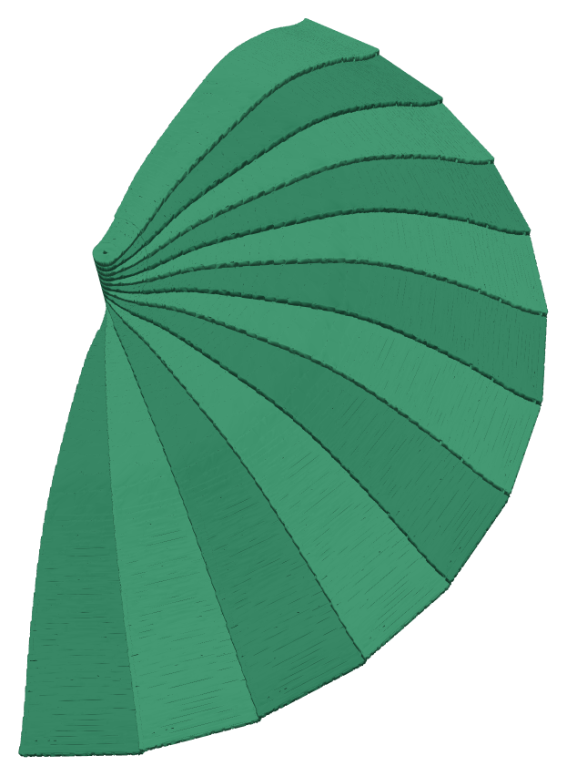
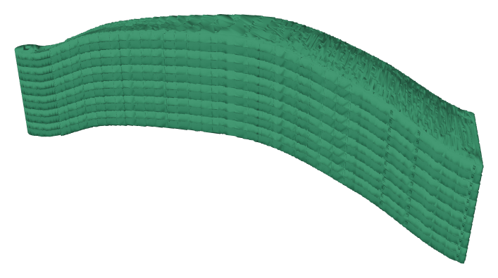
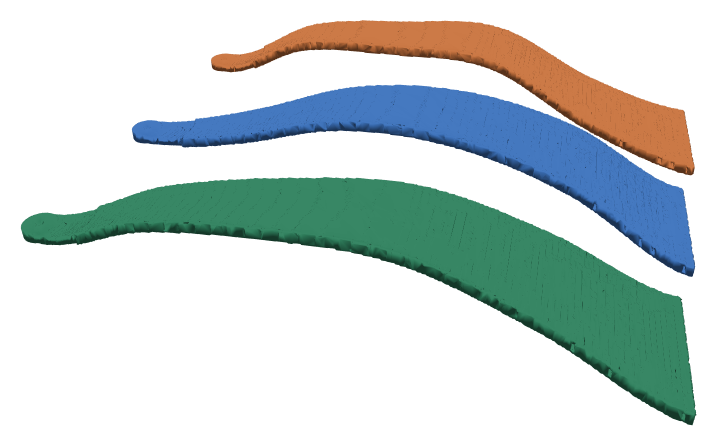

# fan-optimization

**A 3D-printed folding hand fan designed by optimization.** The blade shape is searched with
Bayesian optimization over 3D unsteady CFD (SU2), then each winning blade is hollowed out by 3D
topology optimization, and the result is exported as a printable, watertight STL.

<p align="center">
  
  &nbsp;&nbsp;
  
</p>
<p align="center"><sub>Design 00 (final print meshes), deployed and folded — 12 blades × 13.3° on a Ø3 mm pin.</sub></p>

## Status

| | |
|---|---|
| **V1 — computational pipeline** | ✅ complete — geometry, CFD, BO campaign, fine-tier verification, per-blade topology optimization, print export |
| **V1 — print package** | ✅ three designs ready (`00` best wind · `02` best structure · `03` clean) — see the [print guide](docs/print_guide.md) |
| **V1 — physical evaluation** | ⏳ next: print 3 × 12 blades, assemble, blinded A/B feel test vs. a printed flat-panel baseline |
| **V1.5 / V2** | planned — flex-aware ranking (FSI), stiffness/buckling-constrained TO, quantified wind measurement ([backlog](docs/V2_backlog.md)) |

## How it works

```
 blade parameters (33-D codec)                 rib meridian wave, panel offset/thickness grids,
        │                                       rib thickness, rib-mode (ribbed / uniform)
        ▼
 CadQuery generative geometry  ──►  fold-feasibility gate (12 blades must stack ≤ 90 mm)
        │
        ▼
 Gmsh mesh + SU2 unsteady 3D CFD  ──►  J_fan = cycle-mean thrust (CFz) of one blade × 12 blades
        │                                (±40° pitching stroke at 2 Hz)
        ▼
 Bayesian optimization (BoTorch)  ──►  qLogNEHVI + TuRBO trust region over (J_fan ↑, mass ↓, deflection ↓)
        │                                async shared-ledger campaign across parallel Colab sessions
        ▼
 fine-tier CFD re-verification of the top designs (coarse → fine)
        │
        ▼
 per-design 3D SIMP topology optimization  ──►  freeze the aero skin, carve the interior
        │                                        under stroke / inertial / click load cases
        ▼
 marching cubes → rib restore → watertight STL → Bambu Studio
```

<p align="center">
  
</p>
<p align="center"><sub>The three V1 blades: 00 (green), 02 (blue), 03 (orange). Rotate them in 3D in
<a href="docs/models/"><code>docs/models/</code></a>.</sub></p>

Key design decisions are recorded as ADRs — start at [`docs/adr/README.md`](docs/adr/README.md):

- **ADR-0003** aero-first solid blade: a surface of revolution about the pin, so any wave shape still folds.
- **ADR-0004** optimize on a true 3D objective. An audit found the earlier 2D-slice objective was
  blind to the rib wave (the main wind lever), so the campaign was redone cold on 3D CFD.
- **ADR-0005** 12 blades, 220 mm trapezoid planform, blade + boss as one printed part.
- **ADR-0007** per-design 3D topology optimization instead of a single representative 2D rib.
- **ADR-0008** known limitation: ranking used the rigid blade (no fluid–structure coupling).

## Repository layout

```
src/fanopt/
  geometry/   blade parametrization, CadQuery CAD, fold gate, fan posing, TO → STL export
  cfd/        SU2 config rendering (Jinja2), Gmsh meshing, 3D blade aero, J_fan extraction
  bo/         codec, BoTorch backbone (GP, qLogNEHVI, TuRBO), distributed campaign, results
  topopt/     3D FEA mesh, load cases, SIMP blade topology optimization
  physical/   analysis for the (V2) physical rigs: IMU, anemometer, acoustics, click rig
  utils/      JSONL ledger and shared helpers
scripts/      thin CLI entry points (one per phase / spike)
notebooks/    Colab orchestration notebooks (campaign, verification, TO, review)
configs/      SU2 .cfg.j2 templates, Fusion 360 add-in
tests/        pytest suite mirroring src/ + the docs audit gate
docs/         ADRs, plan, locks index, phase logs, print guide, V2 backlog
```

## Setup

```bash
conda env create -f environment.yml    # CadQuery, Gmsh, SU2, FEniCSx, PyTorch
conda activate fanopt
pip install -e ".[dev]"
pre-commit install
```

The CFD campaign and topology optimization run on Colab (see [`notebooks/`](notebooks/README.md));
geometry, tests, and post-processing run locally.

## Tests

```bash
pytest                    # full suite (optional-dependency tests skip when gmsh / SU2 / BoTorch are absent)
pytest -m "not slow"      # skip slow tests
pytest tests/test_audit   # docs audit gate (retired-phrase scanner)
```

## Documentation map

| Want to… | Read |
|---|---|
| Know the current decision on any topic | [`docs/adr/README.md`](docs/adr/README.md) |
| Print and assemble the V1 fans | [`docs/print_guide.md`](docs/print_guide.md) |
| See locked constants and why | [`docs/locks_index.md`](docs/locks_index.md) |
| See what's deferred to V1.5 / V2 | [`docs/V2_backlog.md`](docs/V2_backlog.md) |
| Read the original full plan (historical) | [`docs/report-final.md`](docs/report-final.md) |
| Follow the phase-by-phase log | [`docs/phase_checklist.md`](docs/phase_checklist.md), [`docs/phase_logs/`](docs/phase_logs/) |
| Contribute with Claude Code | [`CLAUDE.md`](CLAUDE.md) (code, test, and process rules) |

## License

MIT
